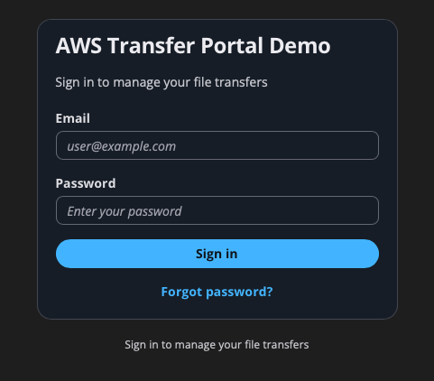
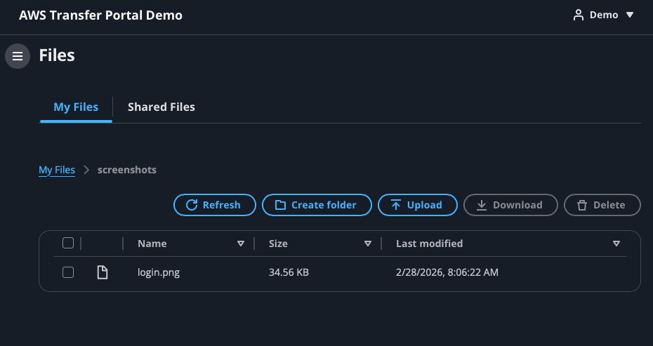
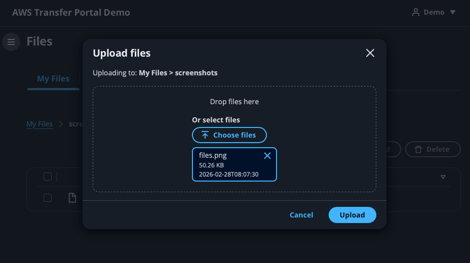
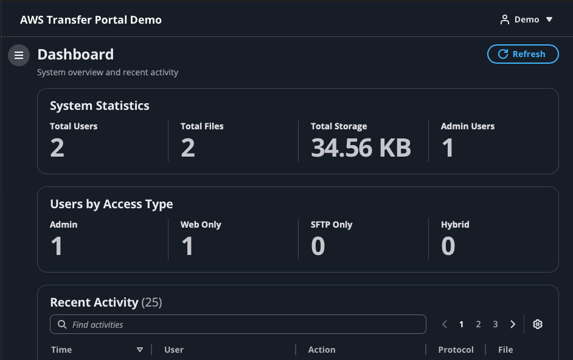
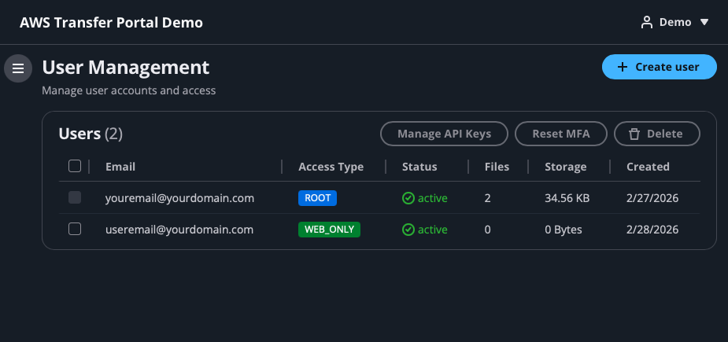
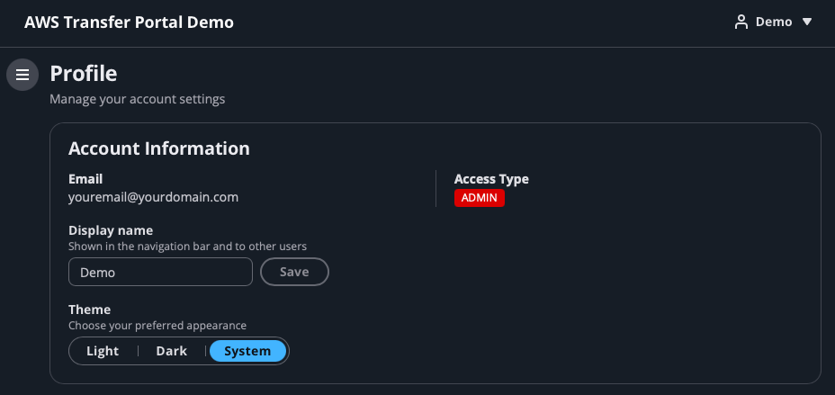
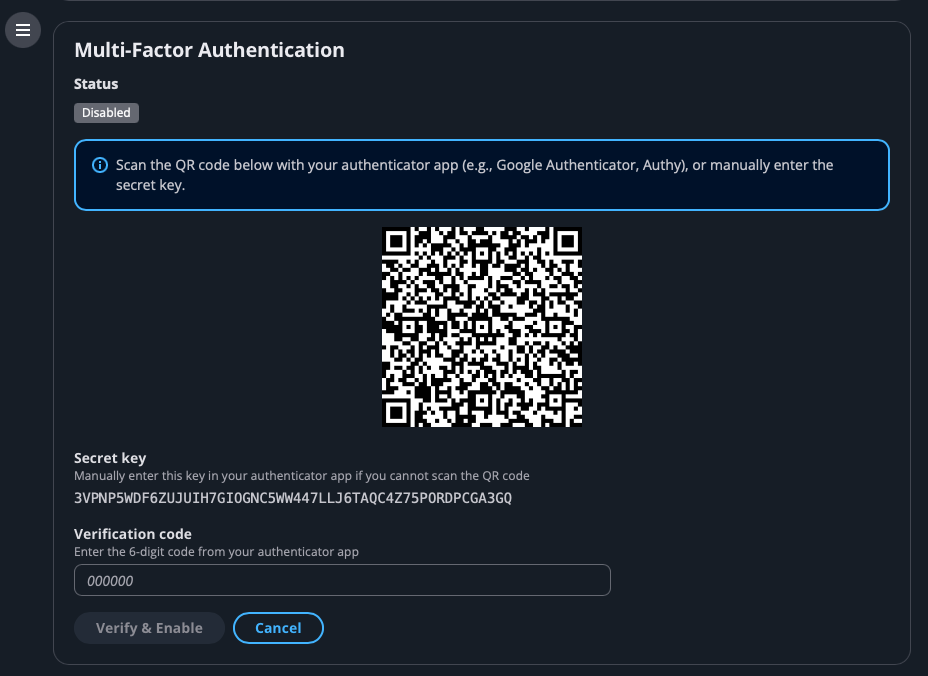
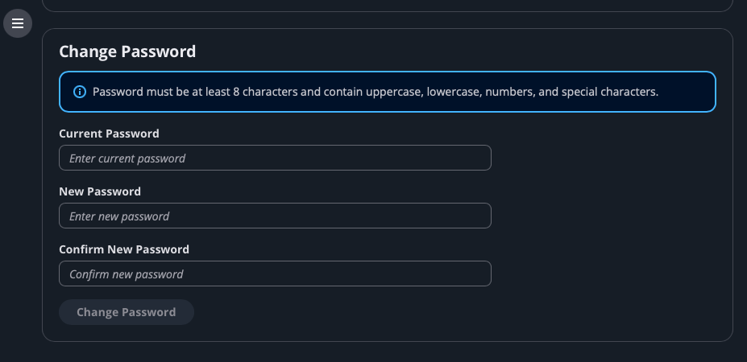
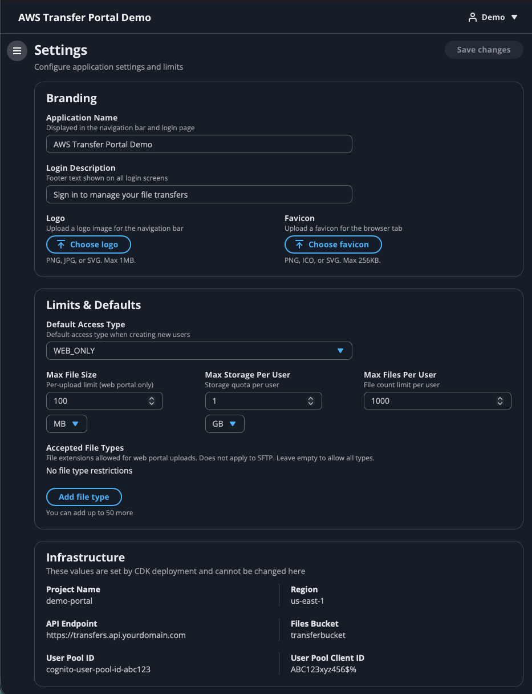
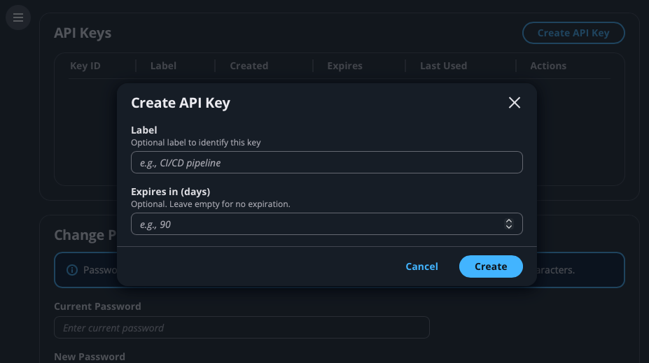

# AWS Transfer Portal

A production-grade web application for managing file transfers on AWS. Built as a fully serverless, infrastructure-as-code solution that deploys in minutes and costs under $10/month.

**Live demo**: [transferportal.rustynations.com](https://transferportal.rustynations.com)


---

## What Is This?

A complete file transfer portal — authentication, file management, user administration, activity logging — built entirely on AWS managed services. No servers to patch. No containers to orchestrate. Just deploy and go.

Think of it as a self-hosted alternative to services like WeTransfer or ShareFile, running in your own AWS account with full control over data residency, access policies, and cost.

### Who Is This For?

- Teams that need a simple, secure way to exchange files without standing up an FTP server
- Organizations that want browser-based file management with optional SFTP for automation
- Developers looking for a real-world reference architecture for serverless full-stack applications on AWS

---

## What It Does

### For Users
- Upload and download files through a clean, familiar interface (AWS Cloudscape Design System)
- Organize files in hierarchical folders with breadcrumb navigation
- Private file storage with optional shared folders for collaboration
- TOTP multi-factor authentication for account security

### For Admins
- Create and manage users with role-based access control (Admin, Web-Only, SFTP, Hybrid)
- Real-time dashboard with storage metrics, user statistics, and activity monitoring
- Activity logging with 30-day retention and filtering
- Root user protection to prevent accidental lockout

### For Your AWS Bill
- Web-only mode: **~$3–8/month** (S3, DynamoDB, Lambda, API Gateway, Cognito)
- With SFTP enabled: **~$220/month** (adds AWS Transfer Family endpoint at $0.30/hr)
- Toggle SFTP on or off with a single config flag — no rewrite, just redeploy

---

## Screenshots

| | |
|:---:|:---:|
|  |  |
| Cognito authentication with MFA support | File browser with folders, upload, download |
|  |  |
| Drag-and-drop upload with progress tracking | Admin dashboard with real-time metrics |
|  |  |
| User management with role-based access control | Self-service profile and display name |
|  |  |
| TOTP multi-factor authentication enrollment | Self-service password management |
|  |  |
| Portal customization and branding | API keys for programmatic access without SFTP |

---

## Architecture

```
┌─────────────┐     ┌──────────────┐     ┌─────────────────┐
│  CloudFront  │────▶│  S3 (Static) │     │  S3 (Storage)   │
│  + ACM Cert  │     │  React SPA   │     │  User Files     │
└─────────────┘     └──────────────┘     └────────▲────────┘
                                                   │
┌─────────────┐     ┌──────────────┐     ┌────────┴────────┐
│   Cognito    │────▶│ API Gateway  │────▶│     Lambda      │
│  User Pool   │     │  REST API    │     │  (6 functions)  │
└─────────────┘     └──────────────┘     └────────┬────────┘
                                                   │
                    ┌──────────────┐     ┌────────┴────────┐
                    │  Transfer    │────▶│    DynamoDB      │
                    │  Family      │     │  Users/Activity  │
                    │  (optional)  │     └─────────────────┘
                    └──────────────┘
```


**Everything is defined in code.** The companion [infrastructure repo](https://github.com/rusty428/aws-transfer-portal-infra) provisions all AWS resources via CDK. The CI/CD pipeline builds this frontend and deploys it to CloudFront automatically on every push.

---

## Why This Exists

This project started as a practical need — a secure, low-cost way to manage file transfers without paying for commercial SaaS or maintaining legacy FTP infrastructure.

It evolved into a reference implementation that demonstrates:

- **Full-stack serverless architecture** — React frontend backed by API Gateway, Lambda, DynamoDB, S3, and Cognito, with no running servers
- **Infrastructure as code** — Every resource defined in AWS CDK with decoupled, independently deployable stacks
- **Production patterns** — MFA, role-based access control, activity auditing, root user protection, pre-signed URL security, user isolation via session policies
- **Cost-conscious design** — The SFTP toggle alone drops monthly cost from ~$220 to under $10 by conditionally provisioning Transfer Family resources
- **CI/CD pipeline** — CodePipeline pulls from GitHub, CodeBuild injects environment variables from CDK outputs, deploys to S3, and invalidates CloudFront — zero manual steps after initial setup

This isn't a tutorial or a toy. It's a working system deployed to a real AWS account, serving real traffic, with real operational considerations baked in.

---

## Quick Start

### Prerequisites
- Node.js 18+
- AWS account with CDK bootstrapped
- Deployed [transfer-portal-infra](https://github.com/rusty428/aws-transfer-portal-infra) backend

### Local Development

```bash
git clone https://github.com/rusty428/aws-transfer-portal-frontend.git
cd aws-transfer-portal-frontend
npm install
cp .env.example .env.local
# Update .env.local with your CDK deployment outputs
npm run dev
```

### Production Deployment

The infrastructure repo includes a CI/CD pipeline that automatically builds and deploys this frontend. Push to `main` and the pipeline handles the rest — no manual S3 sync or CloudFront invalidation needed.

Environment variables (API endpoint, Cognito pool IDs) are injected at build time by CDK, not stored in the repo.

---

## Tech Stack

| Layer | Technology | Why |
|-------|-----------|-----|
| UI Framework | React 19 | Component model, ecosystem, TypeScript support |
| Design System | Cloudscape | Native AWS look and feel, accessible, production-tested |
| Language | TypeScript (strict) | Type safety across the full stack |
| Build | Vite | Fast dev server, optimized production builds |
| Auth | amazon-cognito-identity-js | Direct Cognito integration with MFA support |
| Testing | Vitest + fast-check | Unit tests and property-based testing |
| Hosting | S3 + CloudFront | Global CDN, HTTPS, custom domain |
| CI/CD | CodePipeline + CodeBuild | Automated build and deploy on push |

---

## Project Structure

```
src/
├── components/          # Reusable UI components
│   ├── layout/          # App shell, navigation
│   ├── BreadcrumbTrail  # Folder navigation
│   ├── FileTable        # File/folder listing with selection
│   └── ...
├── pages/               # Route-level components
│   ├── Login            # Auth with MFA challenge flow
│   ├── Files            # Upload, download, folder management
│   ├── Dashboard        # Admin metrics and activity
│   ├── Users            # User CRUD with role management
│   ├── Profile          # Password, MFA, display name
│   └── Settings         # App configuration (admin)
├── utils/               # Shared logic
│   ├── auth.ts          # Cognito auth with full MFA lifecycle
│   ├── api.ts           # API client with error handling
│   ├── permissions.ts   # Role-based access control
│   └── pathUtils.ts     # Folder path construction
└── config.ts            # Environment configuration
```

---

## Related

- [aws-transfer-portal-infra](https://github.com/rusty428/aws-transfer-portal-infra) — CDK infrastructure for this project
- [aws-spa-hosting-kit](https://github.com/rusty428/aws-spa-hosting-kit) — Reusable S3 + CloudFront hosting pattern used here
- [aws-spa-react-example](https://github.com/rusty428/aws-spa-react-example) — Minimal React SPA template for the hosting kit

---

## License

MIT — see [LICENSE](LICENSE)

---

Built by [Rusty Nations](https://rustynations.com)
